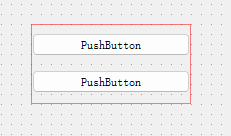

# 1.Layouts系列组件【布局相关*】
## 1.1 Vertical Layout垂直布局

## 1.2 Horizontal Layout水平布局

## 1.3 Grid Layout表格布局

## 1.4 Form Lsyout表单布局


# 2.Spacers系列组件【】
Horizontal Spacer 和 Vertical Spacer 组件是用于布局管理的空白部件，通常在使用布局管理器（如网格布局、垂直布局、水平布局等）时使用。它们在界面设计中起到调整部件之间间距和布局的作用。

## 2.1 Horizontal Spacer
Horizontal Spacer：水平间距组件会自动调整其宽度，以填充水平空间。它通常用于将其他部件推向布局中的一侧，从而使其他部件集中在布局的另一侧或中心。

## 2.2 Vertical Spacer
Vertical Spacer：垂直间距组件会自动调整其高度，以填充垂直空间。它的作用类似于水平间距组件，但是用于垂直方向的布局。


## 2.3 spacers系列与layout系列的区别[拿Horizontal 举例]
Horizontal Spacer:
- 作用：Horizontal Spacer 是一个用于布局管理的空白部件，用于在水平方向上填充空白并控制部件之间的间距。
- 功能：它会自动调整其宽度以填充水平空间，通常用于在水平布局中调整部件之间的距离或将部件推向布局的一侧。
- 示例用途：用于实现居中对齐、调整部件位置、拉伸部件等布局效果。

Horizontal Layout:
- 作用：Horizontal Layout 是一种布局管理器，用于在水平方向上排列和管理部件。
- 功能：它负责将添加到其中的部件水平排列，并根据布局的设置自动调整部件的大小和位置。
- 示例用途：用于在水平方向上排列多个部件，使它们按照一定顺序水平排列显示。

区别总结：
- 功能不同：Horizontal Spacer 主要用于控制空白和间距，而 Horizontal Layout 用于管理和排列部件。
- 作用对象不同：Horizontal Spacer 是一个单独的空白部件，而 Horizontal Layout 是一种布局管理器，可以包含多个部件。
- 应用场景：Horizontal Spacer 适用于调整布局中部件之间的空白和间距，而 Horizontal Layout 适用于组织和排列多个部件。

# 3.Buttons系列组件
## 3.1 Push Button
PushButton 是一种常见的用户界面部件，用于触发操作或事件。当用户点击按钮时，会触发特定的操作或响应。下面是一些 PushButton 的常见用途和示例代码：

PushButton 的作用和用途：
- 触发操作：PushButton 通常用于触发特定的操作，如保存数据、提交表单、启动进程等。
- 导航：在导航栏中，PushButton 可以用作导航按钮，帮助用户切换页面或执行特定的导航操作。
- 确认和取消：在对话框中，PushButton 可以用作确认或取消按钮，使用户能够确认或取消操作。
- 启动功能：在工具栏或菜单中，PushButton 可以用于启动特定功能或操作。

```
import sys
from PySide2.QtWidgets import QApplication, QWidget, QPushButton, QMessageBox

class Example(QWidget):
    def __init__(self):
        super().__init__()

        self.initUI()

    def initUI(self):
        self.setWindowTitle('PushButton Example')
        self.setGeometry(300, 300, 300, 200)

        # 创建一个PushButton
        button = QPushButton('Click Me', self)
        button.clicked.connect(self.showDialog)

        self.show()

    def showDialog(self):
        # 弹出消息框
        QMessageBox.information(self, 'Message', 'Button Clicked!')

if __name__ == '__main__':
    app = QApplication(sys.argv)
    ex = Example()
    sys.exit(app.exec_())
```
## 3.2 Tool Button
ToolButton 的作用和用途：

作用：ToolButton 是一种用于在工具栏或工具栏中显示工具图标或文本的按钮，通常用于触发特定的功能或操作。

用途：
- 工具栏操作：在应用程序的工具栏上，ToolButton 可以用于提供快速访问常用功能和操作。
- 下拉菜单：ToolButton 通常与下拉菜单结合使用，以提供更多的选项和功能。
- 工具栏分组：通过将多个 ToolButton 放置在同一个工具栏中，可以将相关功能组合在一起。
```
import sys
from PySide2.QtWidgets import QApplication, QWidget, QVBoxLayout, QToolButton

class Example(QWidget):
    def __init__(self):
        super().__init__()

        self.initUI()

    def initUI(self):
        self.setWindowTitle('ToolButton Example')
        self.setGeometry(300, 300, 300, 200)

        layout = QVBoxLayout()

        # 创建 ToolButton
        tool_button1 = QToolButton()
        tool_button1.setText('Save')
        # tool_button1.setIcon(QIcon('save.png'))  # 设置图标
        tool_button1.clicked.connect(self.save_function)  # 连接保存功能

        tool_button2 = QToolButton()
        tool_button2.setText('Print')
        # tool_button2.setIcon(QIcon('print.png'))
        tool_button2.clicked.connect(self.print_function)

        layout.addWidget(tool_button1)
        layout.addWidget(tool_button2)

        self.setLayout(layout)

    def save_function(self):
        # 执行保存功能
        print('Save function called')

    def print_function(self):
        # 执行打印功能
        print('Print function called')

if __name__ == '__main__':
    app = QApplication(sys.argv)
    ex = Example()
    ex.show()
    sys.exit(app.exec_())
```

## 3.3 Radio Button
RadioButton 的作用和用途：

作用：RadioButton 是一种用于在一组选项中选择单个选项的按钮，通常用于实现单选功能。

用途：
- 选项选择：在设置界面或表单中，RadioButton 可以用于让用户从多个互斥选项中选择一个。
- 过滤器：在数据筛选或过滤操作中，RadioButton 可以用于设定特定的过滤条件。
- 选项组合：将多个 RadioButton 放置在一起，可以让用户从一组选项中选择一个。
```
import sys
from PyQt5.QtWidgets import QApplication, QWidget, QVBoxLayout, QRadioButton

class RadioButtonExample(QWidget):
    def __init__(self):
        super().__init__()
        self.initUI()

    def initUI(self):
        self.setWindowTitle('RadioButton Example')
        self.setGeometry(300, 300, 300, 200)

        layout = QVBoxLayout()

        # 创建 RadioButton
        radio_button1 = QRadioButton('Option 1')
        radio_button1.setChecked(True)  # 设置默认选中

        radio_button2 = QRadioButton('Option 2')

        layout.addWidget(radio_button1)
        layout.addWidget(radio_button2)

        self.setLayout(layout)

if __name__ == '__main__':
    app = QApplication(sys.argv)
    ex = RadioButtonExample()
    ex.show()
    sys.exit(app.exec_())
```
## 3.4 Check Box
CheckBox 的作用和用途：

作用：CheckBox 用于表示两种状态之间的切换，通常用于允许用户选择多个选项中的一个或多个。

用途：
- 多选选项：在设置界面、表单或对话框中，CheckBox 可以用于让用户选择多个选项。
- 功能开关：在应用程序中，CheckBox 可以用于启用或禁用特定功能或选项。
- 确认框：在确认某些操作时，CheckBox 可以用作确认框的一部分，例如“我同意服务条款”。
```
import sys
from PyQt5.QtWidgets import QApplication, QWidget, QVBoxLayout, QCheckBox

class CheckBoxExample(QWidget):
    def __init__(self):
        super().__init__()
        self.initUI()

    def initUI(self):
        self.setWindowTitle('CheckBox Example')
        self.setGeometry(300, 300, 300, 200)

        layout = QVBoxLayout()

        # 创建 CheckBox
        checkbox1 = QCheckBox('Option 1')
        checkbox1.setChecked(True)  # 设置默认选中

        checkbox2 = QCheckBox('Option 2')

        layout.addWidget(checkbox1)
        layout.addWidget(checkbox2)

        self.setLayout(layout)

if __name__ == '__main__':
    app = QApplication(sys.argv)
    ex = CheckBoxExample()
    ex.show()
    sys.exit(app.exec_())
```
## 3.5 Command Link Button
CommandLinkButton 是一种用户界面控件，与普通按钮相比，它通常用于表示执行重要操作或导航到重要页面。CommandLinkButton 通常拥有更大的尺寸和更明显的外观，用于吸引用户的注意力。以下是 CommandLinkButton 的一些常见用途和示例代码：

CommandLinkButton 的作用和用途：

作用：CommandLinkButton 用于表示执行重要操作或导航到重要页面，通常具有更大的尺寸和更明显的外观，以吸引用户的注意力。增强用户界面的可用性和视觉效果。

用途：
- 重要操作：用于触发重要的应用程序功能或操作，例如确认付款、提交表单等。
- 导航：用于导航到重要的页面或特定功能区域，例如跳转到设置页面、查看详情等。
- 提示性操作：用于执行需要用户明确确认的操作，例如删除数据、确认操作等。
```
import sys

from PySide2.QtCore import QSize
from PySide2.QtWidgets import QApplication, QMainWindow, QVBoxLayout, QWidget, QCommandLinkButton

class MainWindow(QMainWindow):
    def __init__(self):
        super().__init__()

        # 设置窗口标题和大小
        self.setWindowTitle("Command Link Button 示例")
        self.setGeometry(100, 100, 300, 200)

        # 创建主Widget和布局
        main_widget = QWidget(self)
        layout = QVBoxLayout(main_widget)

        # 创建 Command Link Button
        command_link = QCommandLinkButton("开始使用", self)
        command_link.setDescription("点击这里以启动应用程序")
        command_link.setIconSize(QSize(32, 32))  # 设置图标大小

        # 将按钮添加到布局
        layout.addWidget(command_link)

        # 连接按钮点击事件
        command_link.clicked.connect(self.on_command_link_clicked)

        # 设置主Widget
        self.setCentralWidget(main_widget)

    def on_command_link_clicked(self):
        print("Command Link Button 被点击!")

# 主程序入口
if __name__ == "__main__":
    app = QApplication(sys.argv)
    window = MainWindow()
    window.show()
    sys.exit(app.exec_())

```


## 3.6 Dialog Button Box
在 PySide2 中，QDialogButtonBox 是一个预定义的按钮布局，通常用于在对话框中放置标准按钮，如确定、取消、应用等，以简化对话框的操作。QDialogButtonBox 可以管理这些按钮的排列和布局，使得在对话框中添加标准按钮变得更加方便。

QDialogButtonBox 的作用和用途：

作用：QDialogButtonBox 用于在对话框中放置标准按钮，使得管理和布局这些按钮更加方便。

用途：
- 标准按钮：用于在对话框中添加标准的按钮，如确定、取消、应用等。
- 按钮布局：用于自动管理这些按钮的排列和布局，使得对话框的操作更加一致和易于使用。
```
from PySide2.QtWidgets import QApplication, QDialog, QVBoxLayout, QLabel, QDialogButtonBox

class CustomDialog(QDialog):
    def __init__(self):
        super().__init__()
        self.initUI()

    def initUI(self):
        self.setWindowTitle('Custom Dialog with QDialogButtonBox')

        layout = QVBoxLayout()

        label = QLabel('This is a custom dialog with QDialogButtonBox.')
        layout.addWidget(label)

        # 创建 QDialogButtonBox，包含标准按钮和自定义按钮
        button_box = QDialogButtonBox(QDialogButtonBox.Ok | QDialogButtonBox.Cancel)
        button_box.addButton('Custom Button', QDialogButtonBox.ActionRole)  # 自定义按钮
        button_box.accepted.connect(self.on_accept)
        button_box.rejected.connect(self.on_reject)
        button_box.clicked.connect(self.on_button_clicked)  # 自定义按钮的点击事件
        layout.addWidget(button_box)

        self.setLayout(layout)

    def on_accept(self):
        print('Accepted.')
        self.accept()

    def on_reject(self):
        print('Rejected.')
        self.reject()

    def on_button_clicked(self, button):
        if button.text() == 'Custom Button':
            print('Custom Button clicked.')

if __name__ == '__main__':
    app = QApplication([])
    dialog = CustomDialog()
    dialog.exec_()
```
# 4.Item Views(Model-Based)系列组件
## 4.1 List View
## 4.2 Tree View
## 4.3 Table View
## 4.4 Column View
## 4.5 Undo view
# 5.Item Widgets (Item-Based)系列组件
List widget
Tree widget
Table widget
# 6.Containers系列组件
Group Box
Scroll Ares
Tool Box
Tab widget
Stacked widget
Frame
widget
MDI Area
Dock widget
Qhxwidget
# 7.Input widgets系列组件
Combo Box
Font Combo Box
Line Edit
Text Edit
Plain Text Edit
Spin Box
Double Spin Box
Time Edit
Date Edit
Date/Time Edit
Dial
Horizontal Scroll Bar
Vertical Scroll Bar
Horizontal Slider
tical slider
Key Sequence Edit
# 8.Display widgets系列组件
Label
Text Browser
Graphics View
Calendsr widget
## LCD Number
QLCDNumber 是 PySide2 中的一个小部件，用于显示数字或文本。它通常用于显示整数或浮点数，类似于数字时钟或计数器。QLCDNumber 提供了一种简单的方式来显示数字，可以根据需要设置显示的数字的位数，小数点的位数等。

以下是一些 QLCDNumber 的常见使用场景和作用：
- 数字显示器：最常见的用途是作为数字显示器，例如显示时间、计数器、温度等数值。 
- 性能监视器：在图形用户界面中，可以使用 QLCDNumber 来显示系统性能指标，如 CPU 使用率、内存占用等。 
- 模拟器界面：在模拟器或仿真器界面中，QLCDNumber 可以用来显示模拟器当前状态或参数。 
- 测量仪表：用于模拟仪表盘，例如电子表盘、速度表等。 
- 计时器：用于显示倒计时或计时器功能。 
- 数据监视器：在数据采集和监视应用程序中，QLCDNumber 可以用来显示实时数据或测量值。

## Progress Bar
## Horizontal Line
## Vertical Line
## OpenGL widget
## QQuickwidget

# 9.PyQt隐藏组件
PlotWidget

# 10.其它


# 11.注意事项
